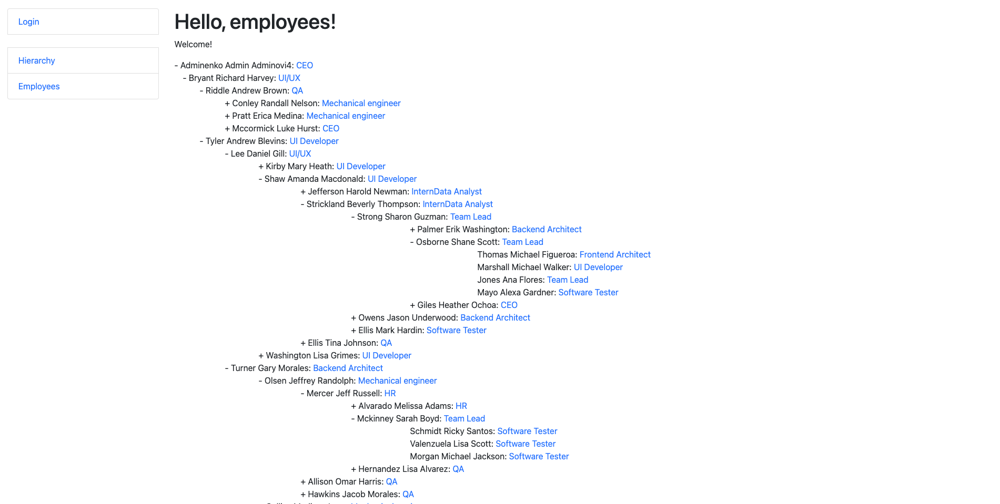
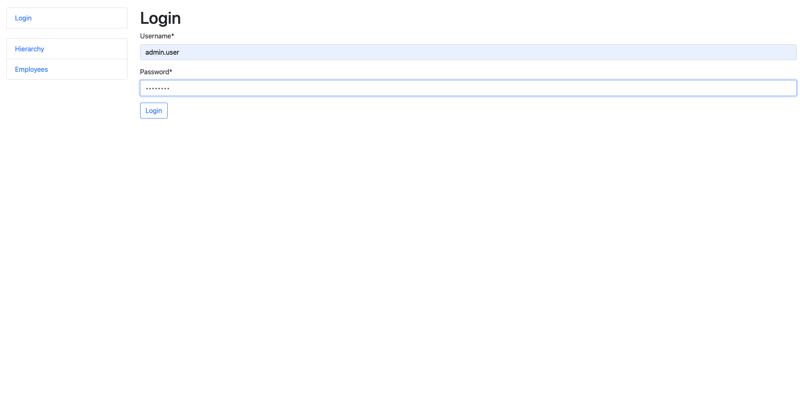
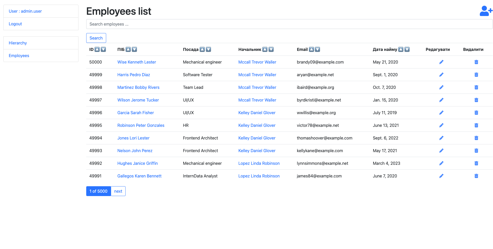
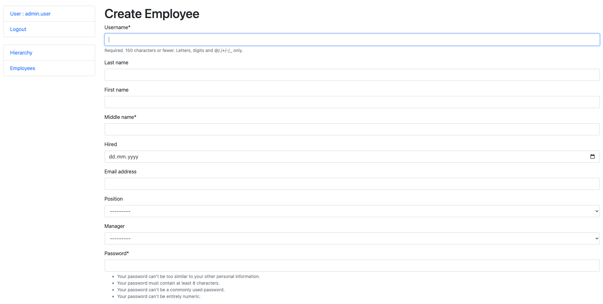
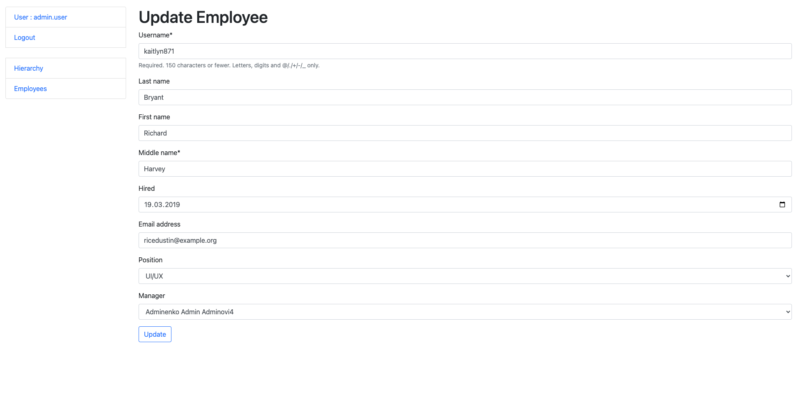
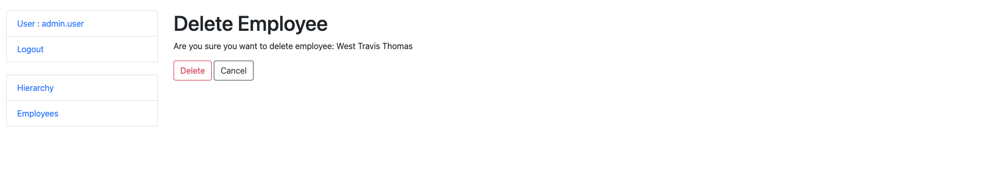
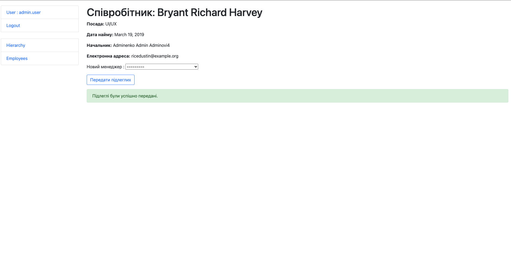
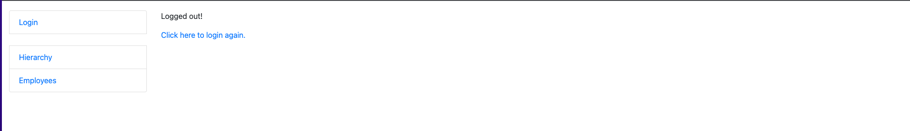
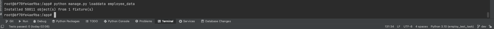

# 💼 Employment web 
A web page that displays the hierarchy of employees in a tree-like format.

## 🖥️ Technologies 


## 📝 Requirements

- Python 3.7+
- Django 4.2.1+
- PostgreSQL

## 🛠 Before installation
1. Clone the project repository

```bash
git clone https://github.com/Anatolii-Poznyak/employ_test_task.git
cd employ_test_task
```
2. Create a virtual environment
```bash
python3 -m venv venv
source venv/bin/activate
```

3. Create .env file based on .env.sample file and set variables.

```bash
cp .env.sample .env
```

- If you want to use Docker, set `POSTGRES_HOST=db` 
- Also set your superuser credentials in `.env`
- 
## 🐳 Run with DOCKER
- DOCKER should be installed

```shell
  docker-compose up
```
- The server will run on 127.0.0.1:8000
- superuser and fake_data will be created and loaded automatically via custom migrations 

## 🖼 Demo pictures
<details>
  <summary>Home</summary>

  
</details>
<details>
  <summary>Login</summary>

  
</details>
<details>
  <summary>Employees</summary>

  
</details>
<details>
  <summary>Create</summary>

  
</details>
<details>
  <summary>Update</summary>

  
</details>
<details>
  <summary>Delete</summary>

  
</details>
<details>
  <summary>Transfer</summary>

  
</details>
<details>
  <summary>Logout</summary>

  
</details>
<details>
  <summary>50.000</summary>

  
</details>

## 📚 Additional info
- To enter the container
```shell
docker ps
docker exec -it <your container name> /bin/bash
```
- For testing: run tests -> `python manage.py test`
- If you want to create your specific amount of test data -> run the following command to create a JSon file (`employee_data.json`) with data -> `python manage.py db_seeder 1500 5` (first param = count of employees, second = level of inheritance). It will overwrite employee_data.json (by default - 1000 records in file with 3 levels of hierarchy)
- To load data from created fixture to your DB -> `python manage.py loaddata employee_data`
